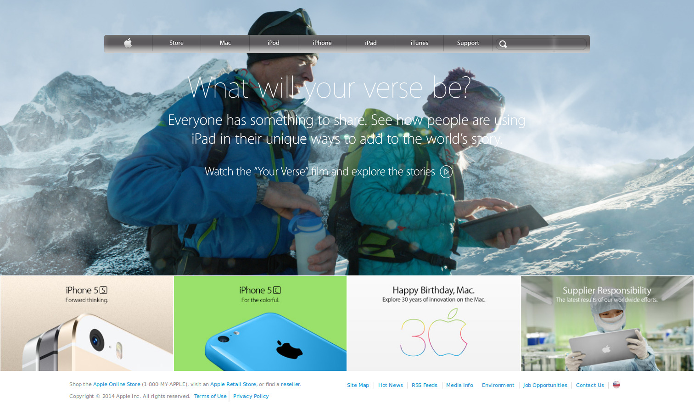

# Project 4 - Apple WebPage Clone

>This is a clone of a previous version of the Apple WebPage . 
>The purpose of this project is to build a webpage from scratch replicating Apple's in the following link: [Web Archive](https://web.archive.org/web/20140301004610/http://www.apple.com/) , using backgrounds and gradients in CSS. The projects requirement and an extended description can be found at [The Odin Project](https://www.theodinproject.com/courses/html5-and-css3/lessons/building-with-backgrounds-and-gradients?ref=lnav)

## Built With

- HTML5 and CSS3 using backgrounds and gradients

**This page was built for it's design so it's not interactive.**

## Authors
👤 **Angel Cordova**

- Github: [@aecordova](https://github.com/aecordova)

## 🤝 Contributing

Contributions, issues and feature requests are welcome!

Feel free to check the [issues page](https://github.com/aecordova/proj4-Apple-Clone/issues).
